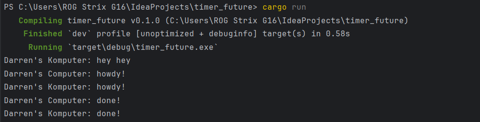

# Module 10 – Asynchronous Programming
**Darren Marcello Sidabutar · 2306256293**

---

## 1.2 · Understanding How It Works

### Screenshot



### Code Modification

In this experiment, I inserted a `println!` statement immediately after calling `spawner.spawn(...)` to help observe how asynchronous tasks are scheduled and executed. Here's a simplified version of the code snippet:

```
spawner.spawn(async {
    println!("async task: howdy!");
    TimerFuture::new(Duration::new(2, 0)).await;
    println!("async task: done!");
});

// Diagnostic println! to observe order
println!("Darren's Computer: hey hey");
```

### What I Observed

Cargo run, and printed:

```
Darren's Computer: hey hey
Darren's Computer: howdy!
Darren's Computer: done!
```

## Experiment Observation: Async Behavior in Rust

This experiment shows that the line **after** the `spawn()` call (`"hey hey"`) runs first, even though it is written *after* the async block in the code.

### Console Output Order

| Console Order | Output Line                  | Explanation                                                                 |
|---------------|------------------------------|-----------------------------------------------------------------------------|
| 1             | `Darren's Computer: hey hey` | `spawn()` is non-blocking, so the main thread continues immediately.       |
| 2             | `Darren's Computer: howdy!`  | The executor starts polling the future, and the async block begins.        |
| 3             | `Darren's Computer: done!`   | After the 2-second timer completes, the future resumes and finishes.       |

### What This Demonstrates

- `spawn()` **schedules** the async task but doesn’t execute it immediately.
- The **main thread continues** right after `spawn()` without waiting.
- Futures in Rust are **lazy**; they only run when polled by an executor.
- This illustrates the **non-blocking** nature of Rust's async model, which is great for efficiently handling many concurrent or I/O-bound tasks.
